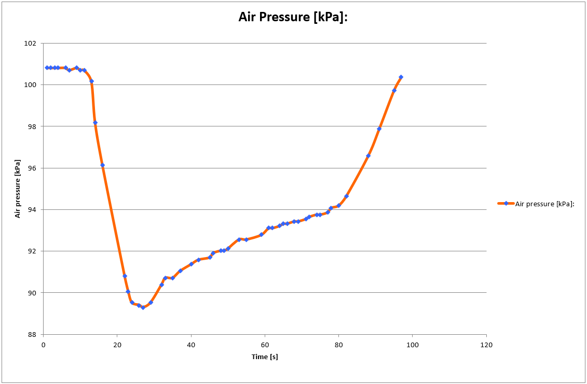
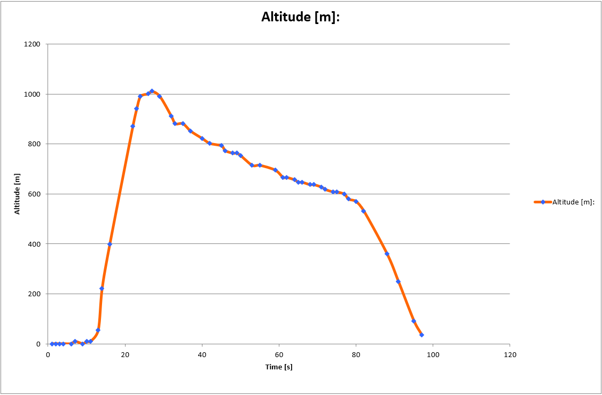

# CanSat

In 2007 - 2008 a CanSat competition took place, hosted by the Delft University of Technology.
In this competition high school student teams had to program a CanSat, a mini-satellite in a Coke can,
which works as a simulation for a real satellite.

This repository describes the software written for this project. The hardware used was a 
BasicATOM PRO 24-M processor ([manual](./BasicATOM/AtomPro24M.pdf)), which uses 
BASIC ([manual](./BasicATOM/atompro_7200.pdf)) as programming language.

## Primary mission
Measure temperature and air pressure every time interval and send the data to the ground station on a 
given frequency.

## Secondary mission
Our team decided on the following mission. The CanSat would go in a rocket up to ~1000 meters altitude.
After being launched from the rocket, a parachute would unfold. Our CanSat would use a small servomotor
to release the parachute at a certain point and land on the ground by crashing, using a crash zone.

The main task of the software was to:
- determine the current altitude;
- control the servomotor to release the parachute at a given altitude (40% of the maximum altitude).

### Results
The altitude could be determined from the air pressure and temperature sensors. However, we found out the
temperature sensor was too unreliable for this task, as it updated too slow. Therefore, we only used air pressure
as a measure for the altitude (the higher above ground, the lower the air pressure).

The following graph shows measurements of the air pressure over time:

From this data a figure with the altitude over time can be plotted:

## Implementation
So how does the software program know when to send a signal to the servomotor to release the parachute and start
the free fall?

Well, as you can see initially the altitude is increasing, but after the rocket releases the CanSat, the altitude
decreases. So by comparing every data point with the previous points, it can be deduced if the system is going up
or down. After several consecutive data points indicating a decreasing altitude, we can be sure we are descending,
 and the servomotor can be signaled to release the parachute.

## Contact
If you have any questions, feel free to [contact me](https://www.linkedin.com/in/benjaminkomen/).